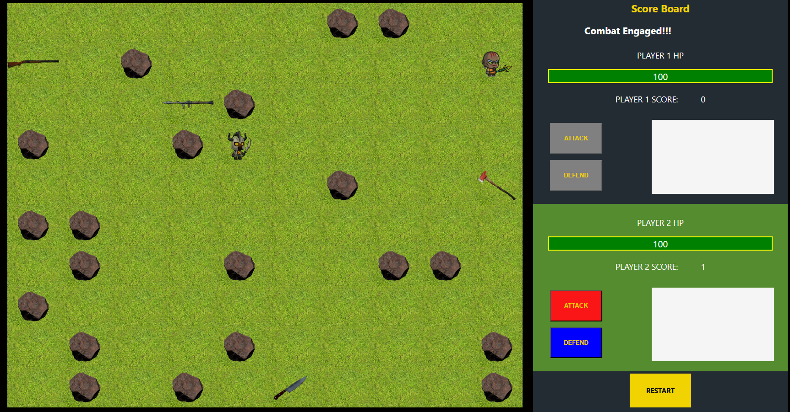

# Web Based Turn Based Board Game

This project is a web-based turn-based board game designed to provide an engaging and strategic gaming experience. Players take turns making moves, with the objective of getting a weapon and achieving victory. The game is built with vanilla javascript, ensuring a smooth and interactive user experience.

## Features

- **Turn-Based Gameplay**: Players alternate turns, allowing for thoughtful and strategic decision-making.
- **Interactive UI**: A visually appealing and user-friendly interface enhances the gaming experience.
- **Multiplayer Support**: Play with friends or challenge opponents online.
- **Customizable Rules**: Adjust game settings to suit different play styles and preferences.
- **Cross-Platform Compatibility**: Accessible on various devices, including desktops, tablets, and smartphones.

## Technologies Used

- HTML
- CSS
- JavaScript

Enjoy the game and have fun strategizing your way to victory!
